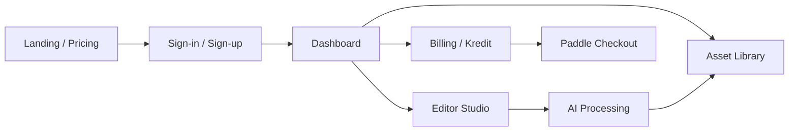

# Rencana Pengujian Otomasi CLARTAS

## 1. Ringkasan Produk

**CLARTAS** adalah platform SaaS visual commerce berbasis AI untuk konten e-commerce: editor foto (33 alat), generator konten/desain, manajemen aset, brand kit, workspace tim, billing Paddle, dan modul intelligence.

| Layer | Teknologi |
|-------|-----------|
| Frontend | Next.js 15, React 19, Tailwind |
| Backend | Server Actions, API Routes |
| Auth & DB | Supabase (Auth, Postgres, Storage, RLS) |
| AI | Fal.ai, Replicate (mock/demo tersedia) |
| Pembayaran | Paddle |

## 2. Alur Aplikasi

**Mode demo** (`NEXT_PUBLIC_DEMO_MODE=true`): bypass auth, kredit unlimited — dipakai untuk smoke/E2E lokal.

## 3. Suite Pengujian

| Suite | Perintah | Tujuan | Durasi estimasi |
|-------|----------|--------|-----------------|
| **Smoke** | `npm run test:smoke` | App hidup, dashboard, nav inti | ~1–2 menit |
| **Sanity** | `npm run test:sanity` | Modul inti setelah deploy | ~2–3 menit |
| **Regression** | `npm run test:regression` | Semua rute app + tema | ~5–8 menit |
| **E2E** | `npm run test:e2e:suite` | Alur multi-langkah | ~3–5 menit |
| **UAT** | `npm run test:uat` | Kriteria penerimaan | ~3–5 menit |
| **Unit** | `npm run test:unit` | Logika bisnis (Vitest) | ~10 detik |
| **Semua** | `npm run test:plan` | Unit + E2E + laporan | ~10–15 menit |

## 4. Traceability

Kasus manual: [`CLARTAS-Kasus-Uji.xlsx`](./CLARTAS-Kasus-Uji.xlsx)  
Pemetaan otomasi: [`tests/helpers/traceability.ts`](../../tests/helpers/traceability.ts)

## 5. Laporan

Setelah `npm run test:plan`:

- HTML interaktif Playwright: `playwright-report/index.html`
- Laporan analisis QA: `docs/qa/reports/laporan-qa-YYYY-MM-DD.html`

## 6. Lingkungan

- **Lokal:** `npm run dev` + demo mode (default `.env.example`)
- **CI:** GitHub Actions — `PLAYWRIGHT_SKIP_WEBSERVER` opsional jika server eksternal

## 7. Kriteria Kelulusan Rilis

- Smoke + Sanity: **100% lulus**
- Regression: **≥ 95% lulus** (flaky max 1)
- Unit/Integration: **100% lulus**
- Zero P0 defect terbuka (dari Excel manual)
